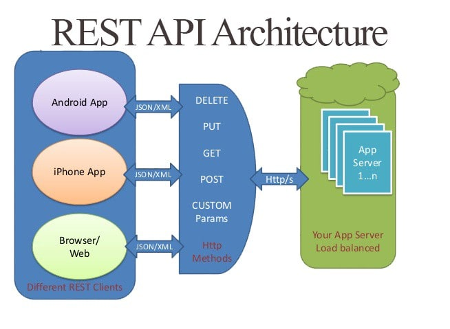

# Documentación del Proyecto: API de Detección de Daños

## Introducción

Este proyecto consiste en una API REST desarrollada con FastAPI para la detección automática de daños en imágenes de vehículos. Utiliza un modelo de aprendizaje profundo entrenado con TensorFlow y Keras para identificar partes del vehículo, tipos de daños y sugerencias de reparación.


## Marco Teórico

La detección de daños en vehículos es una tarea importante en la industria automotriz para facilitar inspecciones rápidas y precisas. El uso de modelos de aprendizaje profundo, especialmente redes neuronales convolucionales (CNN), ha demostrado ser efectivo para el reconocimiento de patrones en imágenes.


*Figura 1: Arquitectura EfficientNet utilizada para la clasificación de imágenes.*

En este proyecto, se utiliza un modelo basado en EfficientNet, una arquitectura CNN eficiente y precisa para clasificación de imágenes. El modelo fue entrenado para clasificar múltiples categorías relacionadas con partes del vehículo, tipos de daños y sugerencias de reparación.

La API recibe imágenes subidas por el usuario, las preprocesa para adaptarlas al modelo, realiza la predicción y devuelve los resultados en formato JSON, incluyendo las etiquetas con mayor probabilidad y una imagen codificada en base64 para referencia.


*Figura 2: ¿Que significa CRUD?.*

         Operaciones CRUD 	Peticiones REST
         INSERT 	         POST
         SELECT 	         GET
         UPDATE 	         PUT
         DELETE 	         DELETE

*Figura 3:Peticiones REST-CRUD.*


*Figura 4: REST-CRUD.*



*Figura 5: Arquitectura REST API.*

## Funcionalidad de la API

- **GET /**: Mensaje de bienvenida y descripción de los endpoints disponibles.
- **POST /predict**: Recibe una imagen y devuelve las predicciones de daños detectados.
- **GET /health**: Verifica el estado de la API y confirma que el modelo está cargado correctamente.

## Estructura del Código

- `main.py`: Archivo principal que contiene la definición de la API, la clase `DamagePredictor` para cargar y usar el modelo, y los endpoints.
- `modelos/final_model.keras`: Archivo del modelo entrenado.
- `predecir/`: Carpeta para almacenar temporalmente las imágenes subidas para predicción.

## Conclusiones

Este proyecto demuestra cómo integrar un modelo de aprendizaje profundo en una API REST para ofrecer un servicio de detección de daños en vehículos. La combinación de FastAPI y TensorFlow permite un despliegue eficiente y escalable.

La documentación y comentarios en el código facilitan la comprensión y mantenimiento del proyecto, permitiendo futuras mejoras como la ampliación del modelo o la integración con sistemas externos.

## Instrucciones para Ejecutar

1. Asegúrese de tener instaladas las dependencias listadas en `requirements.txt`.
2. Ejecute la API con un servidor ASGI, por ejemplo:
   ```
   uvicorn main:app --host 0.0.0.0 --port 10000
   ```
3. Use un cliente HTTP para probar los endpoints, especialmente `/predict` para subir imágenes y obtener predicciones.

### Despliegue en Render.com

La API está desplegada y disponible públicamente en Render.com. Puede realizar peticiones al endpoint `/predict` usando el siguiente ejemplo con curl:

```bash
curl -X 'POST' \
  'https://detectardannospartessugerencias.onrender.com/predict' \
  -H 'accept: application/json' \
  -H 'Content-Type: multipart/form-data' \
  -F 'file=@1152.jpg;type=image/jpeg'
```

**URL de la petición:**

`https://detectardannospartessugerencias.onrender.com/predict`

**Ejemplo de respuesta del servidor:**

```json
{
  "prediction": {
    "partes": [
      {
        "label": "Capó",
        "probability": 0.39037683606147766
      },
      {
        "label": "Guardabarros delantero izquierdo",
        "probability": 0.3885451853275299
      },
      {
        "label": "Cerradura maletero",
        "probability": 0.2936892807483673
      }
    ],
    "dannos": [
      {
        "label": "Rotura",
        "probability": 0.7579940557479858
      },
      {
        "label": "Abolladura",
        "probability": 0.33015015721321106
      },
      {
        "label": "Desprendimiento",
        "probability": 0.2787884473800659
      }
    ],
    "sugerencias": [
      {
        "label": "Reemplazar",
        "probability": 0.8899849653244019
      },
      {
        "label": "Reparar",
        "probability": 0.15962791442871094
      }
    ]
  },
  "image_base64": "/9j/4AAQSkZJRgABAQAAAQABAAD/2wBDAAgGBgcGBQgHBwcJCQgKDBQNDAsLDBkSEw8UHRofHh0aHBwgJC4nICIsIxwcKDcpLDAxNDQ0Hyc5PTgyPC4zNDL/2wBDAQkJCQwLDBgNDRgyIRwhMjIyMjIyMjIyMjIyMjIyMjIyMjIyMjIyMjIyM.......sSvcU3ytqh80AIMfd707yXoJAKnFS76AP/2Q=="
}
```
Nota: Para ver la imagen base64, puede implementar el siguiente codigo de python, solo debe copiar y pegar el valor de image_base64:

ver_imagen_base64.py

      import base64
      from PIL import Image
      from io import BytesIO

      base64_str = "/9j/4AAQSkZJRgABAQAAAQABAAD/2wBDAAgGBgcGBQgHBwcJCQgKDBQNDAsLDBkSEw8UHRofHh0aHBwgJC4nICIsIxwcKDcpLDAxNDQ0Hyc5PTgyPC4zNDL/2wBDAQkJCQwLDBgNDRgyIRwhMjIyMjIyMjIyMjIyMjIyMjIyMjIyMjIyMjIyMjIyMjIyMjIyMjIyMjIyMjIyMjIyMjL/wAARCAKZA3cDASIAAhEBAxEB/8QAHwAAAQUBAQEBAQEAAAAAAAAAAAECAwQFBgcICQoL/...."
      image_data = base64.b64decode(base64_str)
      image = Image.open(BytesIO(image_data))
      image.show()


Desde un terminal se ejecuta:

      python ver_imagen_base64.py
---


Para más detalles, consulte el código fuente y los comentarios en `main.py`.

Referncias:

- https://www.redhat.com/es/topics/api/what-is-a-rest-api
- https://jonmircha.com/api-rest
